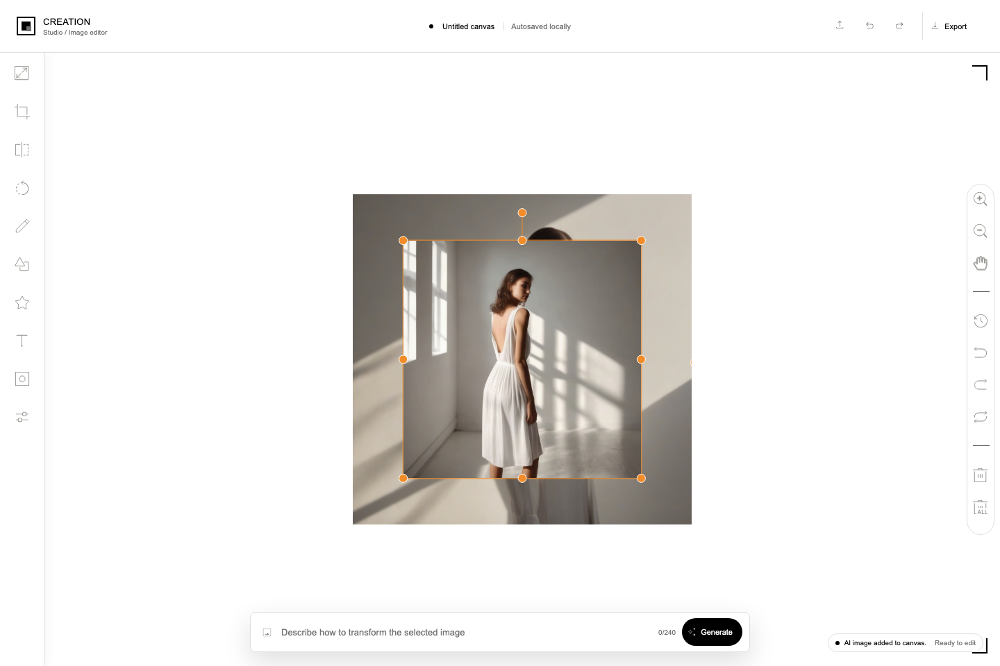
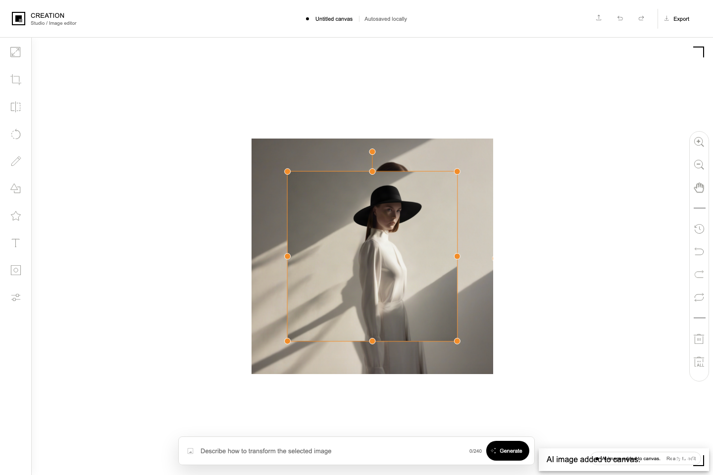

# Creation Studio

Creation Studio is a black-and-white Angular image editor built around TUI Image Editor and a local Hugging Face proxy.

Chinese guide: [README.zh-CN.md](README.zh-CN.md)

## What it does

- Opens with a built-in sample artwork so the canvas is ready immediately.
- Lets you upload a local image and edit it on the TUI canvas.
- Supports crop, rotate, text, grayscale, undo, redo, pan, zoom, reset, and PNG export.
- Supports text-to-image and image-to-image generation, with results inserted into the canvas as new objects.

## Submission checklist

- Complete source code: this public GitHub repository.
- Online demo: [image-design-demo.vercel.app](https://image-design-demo.vercel.app/).
- Bilingual documentation: this English guide is the default GitHub view; the Chinese guide is available at [README.zh-CN.md](README.zh-CN.md).
- Application and AI output screenshots: see [docs/screenshots](docs/screenshots).

## Requirements

- Node.js 18.19+ or newer
- npm
- A Hugging Face access token with Inference Providers permission and available quota for real AI generation
- Image-to-image uses the Chinese-capable `Qwen/Qwen-Image-Edit-2509` by default

## Quick start

```bash
npm install
cp server/.env.example server/.env
# edit server/.env and replace HF_TOKEN with your token; HF_MODEL controls text-to-image and HF_IMAGE_MODEL controls image-to-image
npm run start:api
# in a second terminal
npm start
```

Open `http://localhost:4200`.

The front end proxies `/api` requests to `http://127.0.0.1:4300`, so the API server must stay running while you use real generation.

## Deploy to Vercel

The repository includes `vercel.json` and Vercel Functions for `/api/health` and `/api/ai/generate`.

1. Commit and push the latest code to GitHub, then import the repository into Vercel.
2. Keep the project root as the repository root. Vercel can detect Angular automatically.
3. Add these environment variables in Vercel Project Settings:

```text
HF_TOKEN=your_hugging_face_token
HF_MODEL=stabilityai/stable-diffusion-xl-base-1.0
HF_IMAGE_MODEL=Qwen/Qwen-Image-Edit-2509
HF_IMAGE_PROVIDER=fal-ai
```

4. Deploy. The generated `vercel.app` URL serves the editor and its `/api` functions from the same origin.

Never commit `server/.env` or put `HF_TOKEN` in frontend environment variables.

## How to use the editor

### Edit the canvas

- Top bar: upload, undo, redo, and export.
- Left toolbar: `resize`, `crop`, `flip`, `rotate`, `draw`, `shape`, `icon`, `text`, `mask`, and `filter`.
- Right toolbar: zoom, pan, reset, and delete. Select an image to move, resize, or rotate it; the active selection is orange.

### Text-to-image

1. Leave every canvas image unselected.
2. Enter `A woman in a white dress standing in a bright studio, soft shadows, realistic photography.` in the bottom AI bar and click `Generate`.
3. The generated image is added to the canvas as a new object.

### Image-to-image

1. Select a canvas image and confirm the orange selection box.
2. Enter `Add a black hat to the woman while keeping the background and pose unchanged.` as the edit instruction.
3. Click `Generate`. The edited result is added as a new object and the original remains.

## Design decisions

- Angular owns the application shell and state, while TUI Image Editor provides the proven canvas editing primitives.
- AI calls stay behind a server-side proxy so `HF_TOKEN` never reaches browser code or the Git repository.
- Text-to-image and image-to-image use separate request shapes and configurable Hugging Face models. Selecting a canvas image is the explicit mode switch, so the same prompt bar supports both workflows without adding a second editor.
- The editor stores the canvas document and AI history locally, which keeps the demo useful after a refresh without requiring an account or database.
- The UI keeps a monochrome Creation-style surface and uses orange only for active canvas selection, making the editing target easy to inspect.

## Challenges and solutions

- TUI Image Editor changes its internal canvas dimensions during rotation. The integration now resynchronizes the custom viewport on the next animation frame so a 30-degree rotation stays centered at the original scale.
- Image-to-image requires sending a browser data URL as a binary image to the provider. The proxy validates the data URL, converts it to a `Blob`, and keeps provider-specific prompt protection on the server.
- AI providers can be slow or unavailable. The UI exposes preparing, generating, and processing states, maps common authentication/quota/rate-limit errors to readable messages, and offers retry for transient failures.
- A generated image must become a real editable canvas object. The editor adds it as a new object, scales it to the workspace, and leaves the source image intact for comparison.

## Offline demo mode

If you do not have a Hugging Face token, you can still run the UI by switching `src/environments/environment.ts` to:

```ts
aiMode: 'demo'
```

Then run only:

```bash
npm start
```

Demo mode keeps the full editor flow usable without network access and returns a deterministic sample image.

## Smoke test

Use these steps to verify the project works end to end:

1. Start `npm run start:api`.
2. Start `npm start`.
3. Open `http://localhost:4200`.
4. Keep the default sample and make sure no image is selected.
5. Enter `A woman in a white dress standing in a bright studio, soft shadows, realistic photography.` and click `Generate`.
6. Confirm the loading state appears, then confirm a new generated image is added to the canvas.
7. Select the original canvas image, enter `Add a black hat to the woman while keeping the background and pose unchanged.`, and click `Generate` again.
8. Confirm the edited result is added while the original remains, then click `Export` and confirm a PNG download starts.

The API can be checked without exposing the token:

```bash
curl http://127.0.0.1:4300/api/health
```

The response should report `ok: true` and `configured: true` before testing real generation.

## Screenshots

### Text-to-image

With no canvas image selected, the prompt bar runs text-to-image generation and inserts the new result as an editable canvas object.



### Image-to-image

With the source image selected, the same prompt bar runs image-to-image editing. The example adds a black hat while keeping the original background and pose, and the original image remains available underneath for comparison.


