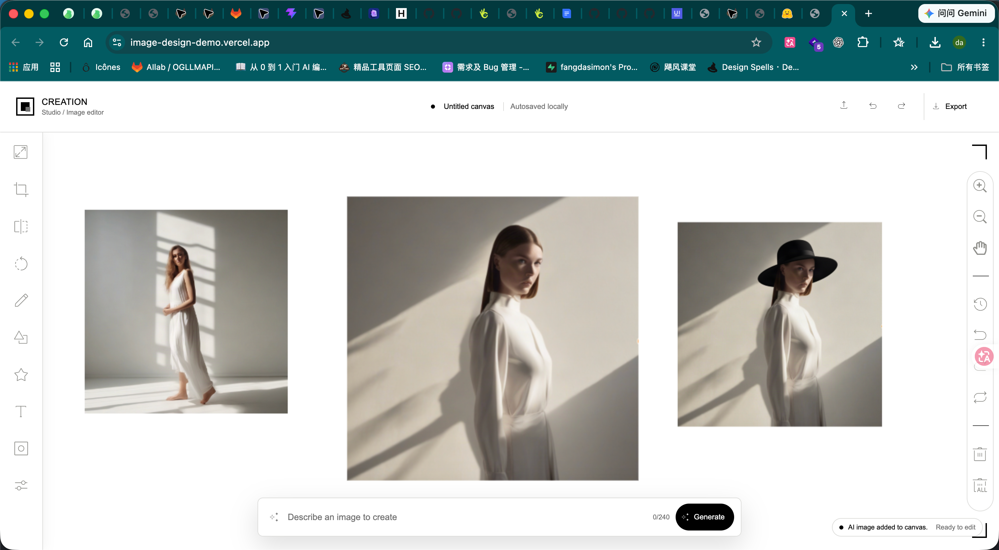

# Creation Studio

Creation Studio is a black-and-white Angular image editor built around TUI Image Editor and a local Hugging Face proxy.

Chinese guide: [README.zh-CN.md](README.zh-CN.md)

## What it does

- Opens with a built-in sample artwork so the canvas is ready immediately.
- Lets you upload a local image and edit it on the TUI canvas.
- Supports crop, rotate, text, grayscale, undo, redo, pan, zoom, reset, and PNG export.
- Supports text-to-image and image-to-image generation, with results inserted into the canvas as new objects and available from the top-right AI version history.

## Submission checklist

- Complete source code: this public GitHub repository.
- Online demo: [image-design-demo.vercel.app](https://image-design-demo.vercel.app/).
- Bilingual documentation: this English guide is the default GitHub view; the Chinese guide is available at [README.zh-CN.md](README.zh-CN.md).
- Application and AI output screenshots: see [docs/screenshots](docs/screenshots).

## Requirements

- Node.js 18.19+ or newer
- npm
- A Hugging Face access token with Inference Providers permission and available quota for real AI generation
- Image-to-image uses the Chinese-capable `Qwen/Qwen-Image-Edit-2509` by default

## Quick start

```bash
npm install
cp server/.env.example server/.env
# edit server/.env and replace HF_TOKEN with your token; HF_MODEL controls text-to-image and HF_IMAGE_MODEL controls image-to-image
npm run start:api
# in a second terminal
npm start
```

Open `http://localhost:4200`.

The front end proxies `/api` requests to `http://127.0.0.1:4300`, so the API server must stay running while you use real generation.

## Deploy to Vercel

The repository includes `vercel.json` and Vercel Functions for `/api/health` and `/api/ai/generate`.

1. Commit and push the latest code to GitHub, then import the repository into Vercel.
2. Keep the project root as the repository root. Vercel can detect Angular automatically.
3. Add these environment variables in Vercel Project Settings:

```text
HF_TOKEN=your_hugging_face_token
HF_MODEL=stabilityai/stable-diffusion-xl-base-1.0
HF_IMAGE_MODEL=Qwen/Qwen-Image-Edit-2509
HF_IMAGE_PROVIDER=fal-ai
```

4. Deploy. The generated `vercel.app` URL serves the editor and its `/api` functions from the same origin.

Never commit `server/.env` or put `HF_TOKEN` in frontend environment variables.

## How to use the editor

### Edit the canvas

- Top bar: upload, AI controls, version history, and export. Undo and redo remain available in the editor toolbar and mobile tools.
- Left toolbar: `resize`, `crop`, `flip`, `rotate`, `draw`, `shape`, `icon`, `text`, `mask`, and `filter`.
- Right toolbar: zoom, pan, reset, and delete. Select an image to move, resize, or rotate it; the active selection is orange.
- On narrow screens, open the floating tools button to access upload, crop, text, grayscale, rotate, undo, and redo without covering the canvas.

### Text-to-image

1. Leave every canvas image unselected.
2. Enter `A woman in a white dress standing in a bright studio, soft shadows, realistic photography.` in the bottom AI bar and click `Generate`.
3. The generated image is added to the canvas as a new object. Open AI controls in the top-right to inspect the active model and style, then use the AI versions section to favorite, download, or add a previous result to the canvas again.

### Image-to-image

1. Select a canvas image and confirm the orange selection box.
2. Enter `Add a black hat to the woman while keeping the background and pose unchanged.` as the edit instruction.
3. Click `Generate`. The edited result is added as a new object and the original remains.

## Design decisions

- Angular owns application state and the workflow UI, while TUI Image Editor supplies the established canvas primitives. This keeps the demo focused on the AI editing flow without rebuilding selection, crop, and transform behavior.
- AI configuration and related actions are grouped under one top-right AI controls entry: mode, provider, model, style preset, batch status, version history, favorites, downloads, and adding results back to the canvas live together. The bottom prompt remains the single generation surface, while image selection automatically chooses text-to-image or image-to-image.
- AI requests go through the server-side proxy, with the token and provider settings kept in environment variables. The browser therefore never needs a credential, and the same API shape works locally and on Vercel.
- When many results share one canvas, an optional Overview/minimap provides a global preview instead of forcing users to search the viewport manually. It shows the content bounds and current viewport, and can recenter the main canvas through a click or drag.

## Challenges and solutions

- **Challenge: TUI's image model is different from the product model.** TUI treats the loaded image as an internal canvas image, but the product needs that image to be a selectable Fabric object that can be compared with generated results. **Solution:** keep TUI's internal image as the canvas-size source, add a matching visible object for selection, and bridge resize/filter operations to the active object. Rotation and undo/redo then resynchronize the custom viewport on the next animation frame. The resize inputs also stop Backspace/Delete from reaching TUI's document-level delete shortcut, which had deleted the selected image while editing a value.
- **Challenge: synchronizing the infinite canvas, zoom, rotation, and minimap coordinates.** Once many results are on the canvas, users cannot quickly find an object or tell whether other results already exist. The Overview/minimap must include multiple objects and rotated bounds, show the current viewport while the main canvas is zoomed or panned, and support navigation without taking over the editor. **Solution:** calculate a world bound from the canvas objects and viewport, render a derived preview through a temporary canvas, restore the main Fabric canvas state afterward, and use animation frames plus `ResizeObserver` to keep full previews and viewport updates in sync. Clicking or dragging the map converts its position back into the main canvas viewport.

## Offline demo mode

If you do not have a Hugging Face token, you can still run the UI by switching `src/environments/environment.ts` to:

```ts
aiMode: 'demo'
```

Then run only:

```bash
npm start
```

Demo mode keeps the full editor flow usable without network access and returns a deterministic sample image.

## Smoke test

Use these steps to verify the project works end to end:

1. Start `npm run start:api`.
2. Start `npm start`.
3. Open `http://localhost:4200`.
4. Keep the default sample and make sure no image is selected.
5. Enter `A woman in a white dress standing in a bright studio, soft shadows, realistic photography.` and click `Generate`.
6. Confirm the loading state appears, then confirm a new generated image is added to the canvas and appears in the AI versions section under the top-right AI controls.
7. Select the original canvas image, enter `Add a black hat to the woman while keeping the background and pose unchanged.`, and click `Generate` again.
8. Confirm the edited result is added while the original remains, then click `Export` and confirm a PNG download starts.
9. At a mobile width, open the tools button and confirm upload, crop, text, grayscale, rotate, undo, and redo remain available.

The API can be checked without exposing the token:

```bash
curl http://127.0.0.1:4300/api/health
```

The response should report `ok: true` and `configured: true` before testing real generation.

## Screenshots

### AI workflow overview

This three-image canvas view demonstrates the complete AI workflow:



From left to right:

1. Text-to-image result generated with `A woman in a white dress standing in a bright studio, soft shadows, realistic photography.`
2. The default image loaded when the editor opens. It is also the source image used for the image-to-image example.
3. Image-to-image result created from the default image with `Add a black hat to the woman while keeping the background and pose unchanged.`

### Text-to-image

With no canvas image selected, the prompt bar runs text-to-image generation and inserts the new result as an editable canvas object.


### Image-to-image

With the source image selected, the same prompt bar runs image-to-image editing. The example adds a black hat while keeping the original background and pose, and the original image remains available underneath for comparison.


